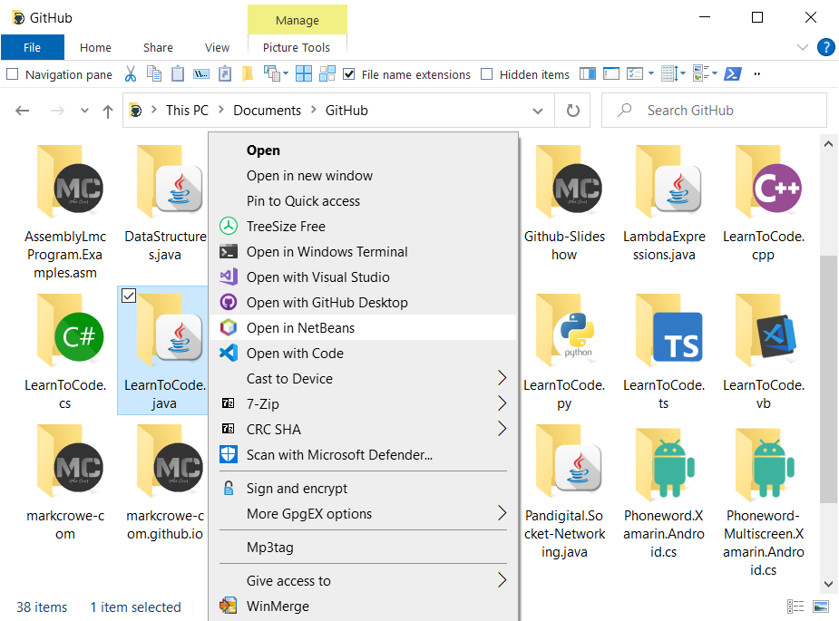

# Apache NetBeans: Application Settings

## Introduction

My NetBeans installation is setup to program in Java.  These are the settings, plugins and styles I use.

## Requirements

- [Java SE Development Kit 16.0.2](https://www.oracle.com/java/technologies/javase-jdk16-downloads.html)
- [Apache NetBeans &gt;= 12.5](https://netbeans.apache.org/)

## Settings

- [netbeans-settings.zip](./releases/netbeans-settings.zip?raw=true) - My recommended settings for NetBeans.
- [netbeans-default.zip](./releases/netbeans-default.zip?raw=true) - The default settings for NetBeans. *(incase you need to reset your changes)*

### Instructions

Open Apache NetBeans.  On the menu bar open `Tools`, choose `Options`.  On the bottom left of the Options windows choose `Import`.  Then in the `Select Options to Import` window click `Browse`, and select `NetBeans-Settings.zip`.  Then click `OK`, click `OK` again.  Then click `Yes`.  NetBeans will now restart with the new settings.

## Settings: Set author name and website

Open Apache NetBeans.  On the menu bar open `Tools`, choose `Templates`.  On the `Template Manager` window, at the bottom right corner click the `Settings` button.  A document `User.properties` will open.  On line 8 it should read
`user=Name Surname <https://github.com/username>`

Change this to your name and website and save and close the file.  For myself it would be
`user=Mark Crowe <https://github.com/markcrowe-com>`

## Windows Context Menu

> 
> Context menu screenshot

To add the Context menu entry save and download the link: [Add-Context-Menu-NetBeans-12.5](./windows-context-menu/Open-In-NetBeans;%20Version%2012.5;%20Add.reg?raw=true) and run the file. For other versions see the [windows-context-menu](./windows-context-menu/) directory and select the file for your version of NetBeans.

To remove the Context Menu save and download the link: [Remove-Context-Menu-NetBeans-12.5](./windows-context-menu/Open-In-NetBeans;%20Remove.reg?raw=true) and run the file.

## Plugin Instructions

Open `Apache NetBeans`.  On the menu bar open `Tools`, choose `Plugins`.  Click the `Settings` tab and tick `NetBeans 8.2 Plugin Portal`.  Then select `Available Plugins` and tick install for the following plugins.

- `gitignore.io`
- `NB SpringBoot`
- `NetBeans Case Converter`
- `sonarlint4netbeans`
- `Rainbow Braces`

Click `Install` and follow any `NetBeans IDE Installers` instructions, choosing `Next`, tick `accept the terms in all of the licence arguments`, clicking `Install` and `Verify Certificates`.

### NetBeans Plugins Used

* gitignore.&#8203;io
* NB SpringBoot
* NetBeans Case Converter
* Rainbow Braces
* sonarlint4netbeans

---

Copyright (c) 2021 Mark Crowe [https://github.com/markcrowe-com](https://github.com/markcrowe-com). All rights reserved.
